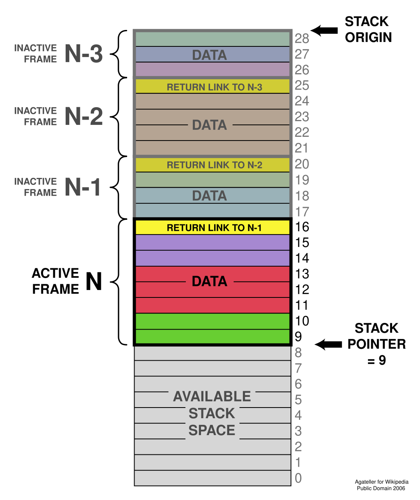

This is the description of how the function is called with it's parameter like where to store the parameter and how to access them

## Stack

First we need to understand how the stack works, The stack is a chunk of memory that growth to the bottom <https://en.wikipedia.org/wiki/Stack-based_memory_allocation> 
As you can see the stack start for the top and grow downwards each function call creates a new stack frame to store it's parameters, and local variables, you can push to the stack with `pushl` that pushes wither register of memory value into the top of the stack but the "top" of the stack is actually the bottom of the stack’s memory.

There is register which know where is the "top" of the stack called `%esp` (stack pointer) always contains a pointer to the current top of the stack, every time we use `pushl` the register `%esp` get subtracted by 4 (word size) because each word is 4 byte.

If you want to remove something from the stack you has to use `popl` that add 4 to the register `%esp`, `popl` will puts the value on top of the stack to whatever register you want.

- If you want to access the value of the top of the stack use `movl (%esp), %eax`, this is indirect access because the `%esp` hold an address but we want the value so we use `(%esp)`

## C language calling convention

Which is the most popular one because it's used in all Unix OS, you can use whatever calling convention you want you can make your own calling convention but when you want to call a function from another language you have obey their calling convention.

Before calling a function we have to push all the parameter into the stack in reverse order like
`add(int a, int b)` -> `pushl b, pushl a`
The we use `call` instruction to call the function it does two things

1. it pushes the address of the next instruction, which is the return address, onto the stack
2. Then it modifies the instruction pointer `%eip` to point to the start of the function

The stack will look something like this

```sh
Parameter #N
...
Parameter 2
Parameter 1
Return Address <--- (%esp)
```

The function itself must do something before doing anything and it's called "prologue"

1. Save the current base pointer register `%ebp` by doing `pushl %ebp` The base pointer is a special register used for accessing function parameters and local variables.
2. Copies the stack pointer register into the base pointer register by doing `movl %esp, %ebp` This allows you to be able to access the function parameters as fixed indexes from the base pointer

`%ebp` Will always be pointing to the beginning of the function when it's called This allow us to know where is our parameters and the local variables even while you may be pushing things on and off the stack. `%ebp`  always be where the stack pointer was at the beginning of the function, so it is more or less a constant reference to the *stack frame* (the stack frame consists of all of the stack variables used within a function, including parameters, local variables, and the return address)

At this point, the stack looks like this

```sh
Parameter #N <--- N*4+4(%ebp)
...
Parameter 2 <--- 12(%ebp)
Parameter 1 <--- 8(%ebp)
Return Address <--- 4(%ebp)
Old %ebp <--- (%esp) and (%ebp)
```

3. The funciton reserve space for all the local variables that the function will use it suppose we need two local variables each is 4 bytes so we will `subl $8, %esp` subtract the 8 bytes from the `%esp`

The stack look like this now

```sh
Parameter #N <--- N*4+4(%ebp)
...
Parameter 2 <--- 12(%ebp)
Parameter 1 <--- 8(%ebp)
Return Address <--- 4(%ebp)
Old %ebp <--- (%ebp)
Local Variable 1 <--- -4(%ebp)
Local Variable 2 <--- -8(%ebp) and (%esp)
```

So we can now access all of the data we need for this function by using base pointer addressing using different offsets from `%ebp`.

When the function finishes and return it does three things.

1. It stores it’s return value in `%eax`.
2. It resets the stack to what it was when it was called (it gets rid of the current stack frame and puts the stack frame of the calling code back into effect).
3. It returns control back to wherever it was called from. This is done using the ret instruction, which pops whatever value is at the top of the stack, and sets the instruction pointer, `%eip`, to that value.

So, before a function returns control to the code that called it, it must restore the previous stack frame. Note also that without doing this, ret wouldn’t work, because in our current stack frame, the return address is not at the top of the stack. Therefore, before we return, we have to reset the stack pointer %esp and base pointer %ebp to what they were when the function began. Therefore to return from the function you have to do the following:

```asm
movl %ebp, %esp
popl %ebp
ret
```

## Reference

- <https://wiki.osdev.org/System_V_ABI>
- <https://wiki.osdev.org/Calling_Conventions>
- <https://uclibc.org/docs/psABI-i386.pdf>
- <https://www.sco.com/developers/devspecs/abi386-4.pdf>
- <https://www.youtube.com/watch?v=9lzW0I9_cpY>
- <https://refspecs.linuxfoundation.org/LSB_5.0.0/LSB-Core-IA64/LSB-Core-IA64/book1.html>
